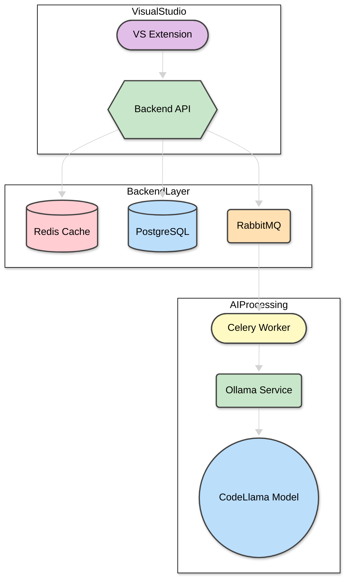

# AI Code Assistant для Visual Studio

## 📋 Описание  
Расширение для Visual Studio, помогающее в написании и улучшении кода с использованием нейросети. Позволяет ускорить разработку за счет интеллектуальных подсказок и автоматизации рутинных задач.

***

## 🛠️ Функционал  
- **Автозаполнение кода**: Подсказки и автозаполнение для ускоренного написания кода.
- **Документация (XML комментарии)**: Создание XML комментариев для методов и классов, улучшая читаемость кода.
- **Встроенный чат с нейросетью**: Возможность задать вопросы и получить ответы от нейросети прямо в редакторе.
- **История запросов**: Сохранение результатов в PostgreSQL  
- **Кэширование**: Повторное использование частых запросов через Redis  

***

## 🏗️ Архитектура  


## Запуск серверной части

1. Клонируем репозиторий:
```bash
  git clone https://github.com/worryeed/VisualStudioExtension.git
  cd VisualStudioExtension
```

2. Редактируем appsettings.json указывая свои данные

3. Переходим в каталог где лежит `docker-compose.yml` и поднимаем все сервисы:
```bash
  docker-compose up -d
```

4. Дожидаемся, пока все контейнеры запустятся. Проверить статус можно командой:
```bash
  docker-compose ps
```

5. API будет доступен по адресу:
https://localhost:5001


